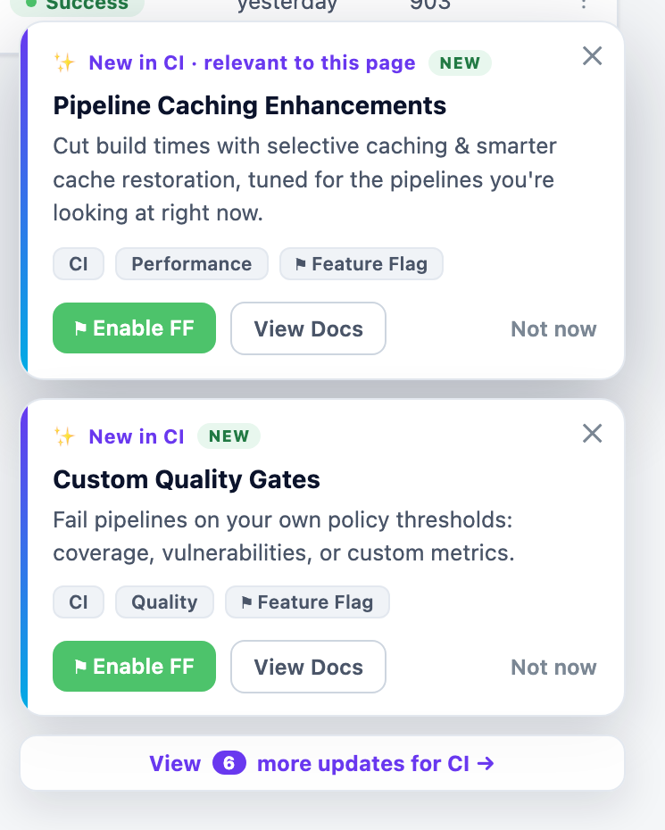

# Feature Feed - Engineering Spec

Scope: **Feature Feed only.** (Tickets & Ask AI extensions are separate phases.)
Two layers: **Publisher** (how cards get created) and **Consumer** (how cards get seen).
Principle: the feed is a **tagged content backend**, not a destination. Cards are surfaced in-context; "What's New" is only the archive.

Mockups: `mvp.html` (Engagement Hub / archive) · `pipelines-nudge.html` (in-context surfacing on a product page).

---

# LAYER 1 - Publisher Flow

No admin panel. No marketing dependency. Cards are a **byproduct of the docs release-notes workflow.**

### 1. Source trigger
1. Doc engineer merges/publishes a **release note** in the docs repo
2. Docs build+deploy pipeline runs as usual
3. New **"Feature Feed" step** added to that pipeline

### 2. Auto-generate step (in docs pipeline)
1. Fires only on **release-notes** files (not doc fixes)
2. Each release-note entry → one candidate card
3. AI enriches card from **fixed vocabularies only** (never invents tags):
   1. **Type** - New / Improved / Deprecated / Beta *(from release-note section)*
   2. **Module** - CI, CD, GitOps, FF, FME, CCM, STO, Chaos, SEI, IDP, IaCM, SSCA, Code Repo, CDE, DBOps, HAR, CET, SRM, Platform
   3. **Sub-module** - scoped to module (e.g. CD → Deployment / Env Groups / Approvals / Templates / Triggers)
   4. **Category** - Performance, UX/Usability, Quality, Security, Productivity, Cost, Integrations
   5. Low confidence → `uncategorized` + flag for human triage (never blocks)
4. Builds card JSON, assigns stable `feature_id` (from release-note slug → idempotent, no dupes on rerun)
5. `POST` to Feature Feed DB

### 3. Enrichment (optional, no UI)
1. Fields not in docs: `video_url`, `image_url`, `feature_flag_key`, `target_routes`, `priority`
2. **`feature_flag_key` comes from the feature owner's PR** (docs can't supply it) - required for the Enable-FF CTA
3. Update path (pick one for v1):
   1. Git-backed card file edited via PR → sync pipeline pushes git → DB *(recommended - natural for engineers, free history/review)*
   2. "Update Feature Feed Card" pipeline run with params (`feature_id` + fields to patch)

### 4. Card schema
| Field | Source | Notes |
|---|---|---|
| feature_id | pipeline | stable, from release-note slug |
| type | release note | New / Improved / … |
| title, description | release note | 1-liner + 2-liner |
| module, sub_modules[], categories[] | AI (fixed vocab) | closed lists |
| publishedAt | pipeline | drives recency + timeago |
| docs_url | release note | Docs CTA |
| video_url, image_url | enrichment | Video / Image CTA |
| feature_flag_key | owner PR | Enable-FF CTA |
| target_routes[] | enrichment | fine-grained page targeting |
| priority | enrichment | ranking + nudge-eligibility |
| eligibility_window | default/enrichment | how long it may surface |

---

# LAYER 2 - Consumer Flow

Same backend, three surfaces. Ranked by adoption impact.

### A. In-context nudge (primary) - `pipelines-nudge.html`
1. Any product page mounts one hook: `useFeatureFeed(pageContext)` → `<FeatureNudge>`
2. Placement: **bottom-right floating spotlight card** - never covers content, slides in, dismissible
3. Show **top 1-2** cards for the page, stacked, with a **"View more"** footer into the Engagement Hub archive; each card dismissible independently



4. **Selection query** for a page:
   ```
   show cards where
     (card.module == page.module OR card.target_routes matches route)
     AND account entitled to card.module        // never surface unusable features
     AND user has NOT dismissed/acted            // impression suppression
     AND user.impressionCount(card) < K          // frequency cap
     AND now within eligibility_window
   rank by priority desc, publishedAt desc
   show top 1-2, subject to global per-session nudge budget
   ```
5. Recency = **ranking** signal, not a hard 1-3 day gate (users may not visit the page in time)
6. CTAs: **Enable FF** (→ confirm dialog → flag ON), View Docs, Watch Video, Not now

### B. What's New bell + archive (secondary)
1. Topbar bell with **unseen-count dot**
2. Click → popover of recent cards → "View all in Engagement Hub"
3. Engagement Hub tab = full searchable/filterable **archive** (ignores impression state); low traffic is expected/fine

### C. Ask AI + MCP tool (highest-conversion)
1. Ask AI bot grounded on the feed → reactive surfacing on user questions
2. **`list_feature_updates` tool in Harness MCP** → Harness DevOps agent fetches cards at point-of-work
3. Tool returns `feature_flag_key` so the agent can chain **awareness → explain → enable FF in one turn** (collapses the adoption funnel)

### Impression / state model
Store per `(userId, accountId, feature_id)` → `{ servedCount, lastServedAt, state }`.
- **served** = actually rendered (not just fetched)
- **dismissed** ("close"/"Not now") → suppress permanently
- **acted** (docs / video / Enable-FF click) → suppress permanently + **count as conversion**
- **ignored** (scrolled past) → increment count; after K servings auto-retire
- API: `POST /feature-feed/{id}/impression { state }`
- These events (`served / dismissed / clicked / ff_enabled`) **are the Mixpanel funnel** - no extra instrumentation

### Guardrails
1. **Frequency cap** - max 1 nudge per surface + global session/day budget + cooldown (make-or-break for not being spammy)
2. **Entitlement filter** - hide features the account can't use
3. Never re-show dismissed/acted cards

---

## APIs
| Method | Path | Layer |
|---|---|---|
| POST | `/feature-feed` | Publisher (pipeline writes card) |
| PATCH | `/feature-feed/{id}` | Publisher (enrichment) |
| GET | `/feature-feed?module=&route=&since=` | Consumer (page surfacing) |
| GET | `/feature-feed/archive` | Consumer (What's New) |
| POST | `/feature-feed/{id}/impression` | Consumer (suppression + analytics) |
| MCP | `list_feature_updates(...)` | Consumer (agent) |

## Where it lives (grounded in cloned repos)
- **Frontend** - `harness-core-ui`: new `src/modules/NN-engagement/` (archive tab) + `useFeatureFeed` hook & `<FeatureNudge>` in `src/modules/10-common`; register nav in `src/framework/types/ModuleName.ts`. Reuse the existing `ResourceCenter/ReleaseNotesModal` pattern.
- **Backend** - `harness-core`: feature-feed service (card CRUD, targeting, impressions).
- **FF integration** - `ff-server` for the Enable-FF CTA.
- **MCP** - Harness MCP server (`genai` module: `mcp-server` / `mcp-server-external`) for `list_feature_updates`.
- **Publisher** - `developer-hub` docs pipeline gets the auto-generate step.

## Open decisions
1. v1 targeting: module-only, or module + route precision? *(suggest module-only v1)*
2. Enrichment model: git-backed PR vs parameterized pipeline? *(suggest git-backed)*
3. Owner of the fixed taxonomy + `uncategorized` triage queue?

## Out of scope (this phase)
Tickets / JIRA sync · comments & reactions · Quarter Timeline · standalone admin panel.

---

## Success metrics
The impression events are the funnel - no extra instrumentation. Three headline numbers, top to bottom:

| # | Metric | Definition | Event |
|---|---|---|---|
| 1 | **Impressions** | cards actually rendered to a user (not just fetched) | `served` |
| 2 | **Actions** | clicks on any CTA - View Docs, Watch Video, Enable FF | `clicked` |
| 3 | **FF enablements** | feature flags turned ON from a nudge CTA (the conversion) | `ff_enabled` |

Read as a funnel: **Impressions → Actions → FF enablements**. Action rate = actions / impressions; conversion rate = FF enablements / impressions. Slice by module, card, and surface (nudge / bell / Ask AI) in Mixpanel.
